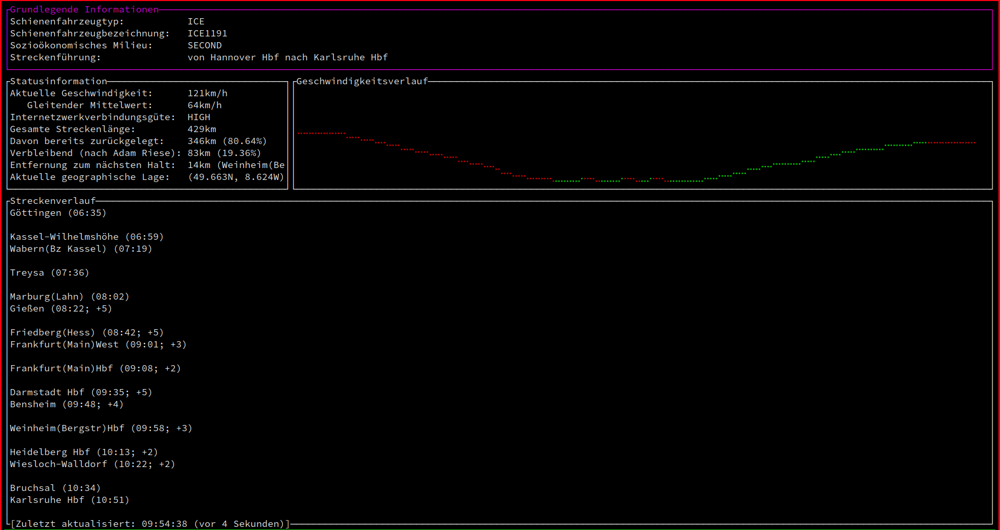

# bahn-status

## About

Ein alternatives ratatui-basiertes TUI-Frontend fuer die Informationen, die die
Deutsche Bahn freundlicherweise im ICE-Intranet unter
[https://iceportal.de/api1/rs/status](https://iceportal.de/api1/rs/status)
sowie
[https://iceportal.de/api1/rs/tripInfo/trip](https://iceportal.de/api1/rs/tripInfo/trip)
bereitstellt. Tatsaechlich findet sich dort auch manches, was nicht in den
Statusanzeigen steht (z.B. Entfernung zum naechsten Ziel, was sehr nuetzlich
sein kann).

## Contribution

☝ Jedes Mal, wenn der Zug zu spaet kommt, schreibe ich eine Zeile Code.
